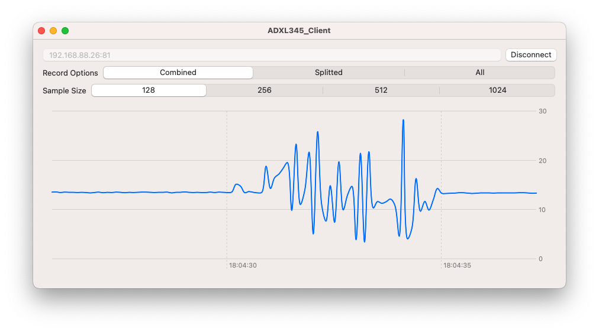

# ADXL345 Sensor Visualizer

## Overview
This MacOS/iOS application connects to the ADXL345 sensor through Websockets and offers a real-time visual representation of the sensor data. Users can view data for the splitter axis (x, y, z) or observe a combined view by summing the x, y, and z values.



## Related Project
The server-side implementation for the ADXL345 sensor using ESP32 can be found [here](https://github.com/RobertKoval/ADXL345_ESP32_Server).

## Features
- Real-time data visualization using Swift Charts.
- Option to view data for individual axes (x, y, z) or a combined line.
- Built with SwiftUI.
- Websocket support using Vapor WebSocketKit.

## Requirements
- MacOS or iOS device.
- ADXL345 sensor setup and running.

## Data Format
Sensor data is streamed in JSON format. Each data packet matches the following structure:

```json
{
    "timestamp": <UInt64>,
    "axisX": <Double>,
    "axisY": <Double>,
    "axisZ": <Double>
}
```

## Getting Started
1. Clone the repository:
   ```bash
   git clone <repository_url>
   ```

2. Navigate to the project directory and open the `.xcodeproj` or `.xcworkspace` file.

3. Build and run the application on your desired MacOS or iOS device.

4. Ensure your ADXL345 sensor is set up correctly and connect to the application using the provided interface.

## Notes
This software was created for personal use and emphasizes simplicity. It may not adhere to all best practices, but it aims to fulfill its purpose effectively.

## Technologies Used
- SwiftUI
- Swift Charts
- Vapor WebSocketKit

## License
This project is open-source. Feel free to use, modify, and distribute as needed.
